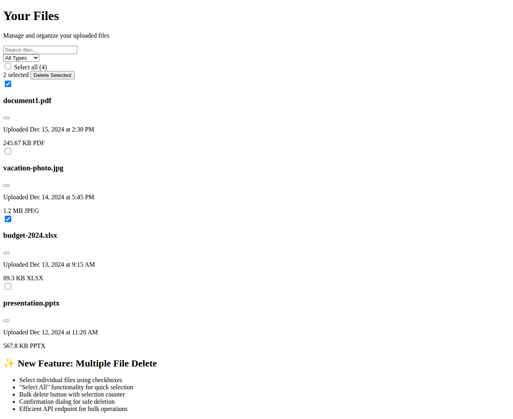

# Multiple File Delete Feature

This document describes the implementation of the multiple file delete feature that allows users to select and delete multiple files at once.

## Overview

Previously, users could only delete one file at a time through individual file action menus. This enhancement adds:
- Checkboxes for multi-file selection
- "Select All" functionality
- Bulk delete action with confirmation
- Efficient bulk deletion API

## Implementation Details

### Frontend Changes

#### 1. Files Page (`src/app/(main)/dashboard/files/page.tsx`)
- Added `selectedFileIds` state for tracking selected files
- Added `handleFileSelect` and `handleSelectAll` functions
- Created bulk delete UI toolbar with selection counter
- Added `bulkDeleteMutation` for handling multiple file deletions
- Updated FileCard component calls to include multi-select props

#### 2. FileCard Component (`src/app/(main)/dashboard/files/_components/FileCard.tsx`)
- Added checkbox prop support (`showCheckbox`, `isSelected`, `onFileSelect`)
- Updated UI to conditionally show selection checkbox
- Maintained existing dropdown menu functionality

#### 3. Service Layer (`src/services/service.ts`)
- Added `DeleteMultipleFileDetails` function for bulk deletion
- Maintains backward compatibility with existing single file deletion

### Backend Changes

#### 4. Bulk Delete API (`src/app/api/deletefiles/route.ts`)
- New endpoint for handling multiple file deletions
- Accepts array of file IDs in request body
- Efficiently processes multiple files in single transaction
- Updates user storage sizes correctly
- Handles Supabase storage cleanup for all files
- Returns detailed response with deletion count

## API Reference

### Bulk Delete Endpoint

**POST** `/api/deletefiles`

Request Body:
```json
{
  "ids": ["file_id_1", "file_id_2", "file_id_3"]
}
```

Response:
```json
{
  "message": "3 file(s) deleted successfully.",
  "success": true,
  "deletedCount": 3
}
```

## User Interface

The new bulk actions toolbar appears between the search/filter section and the file grid:

- **Select All Checkbox**: Allows users to select/deselect all visible files
- **Selection Counter**: Shows how many files are currently selected
- **Delete Selected Button**: Appears only when files are selected
- **Individual Checkboxes**: Each file card now has a checkbox for selection

### User Flow

1. User navigates to the Files page
2. Checkboxes are visible on each file card
3. User can:
   - Click individual checkboxes to select specific files
   - Use "Select All" to select all visible files
   - Click "Delete Selected" when one or more files are selected
4. Confirmation follows the same pattern as single file deletion
5. Selected files are deleted in bulk operation
6. UI updates to reflect changes and clears selection

## Technical Benefits

1. **Efficiency**: Single API call for multiple deletions vs multiple individual calls
2. **User Experience**: Faster bulk operations for large file sets
3. **Consistency**: Follows established patterns from team file management
4. **Maintainability**: Minimal changes to existing codebase
5. **Scalability**: Handles large file selections efficiently

## Testing

The feature includes:
- TypeScript compilation checks
- ESLint compliance
- Logic validation tests
- UI component integration
- API endpoint functionality

## Future Enhancements

Potential improvements for future iterations:
- Move/copy multiple files to teams
- Bulk file operations (rename, download)
- Advanced selection filters
- Keyboard shortcuts for selection
- Progress indicators for large bulk operations

## Screenshot



The screenshot shows the new bulk actions toolbar with checkboxes on file cards, demonstrating the intuitive multi-select interface.